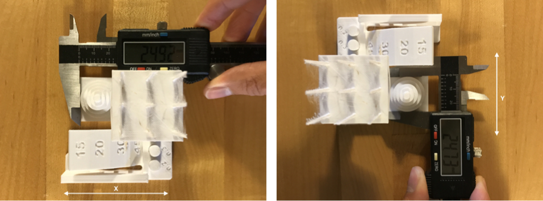
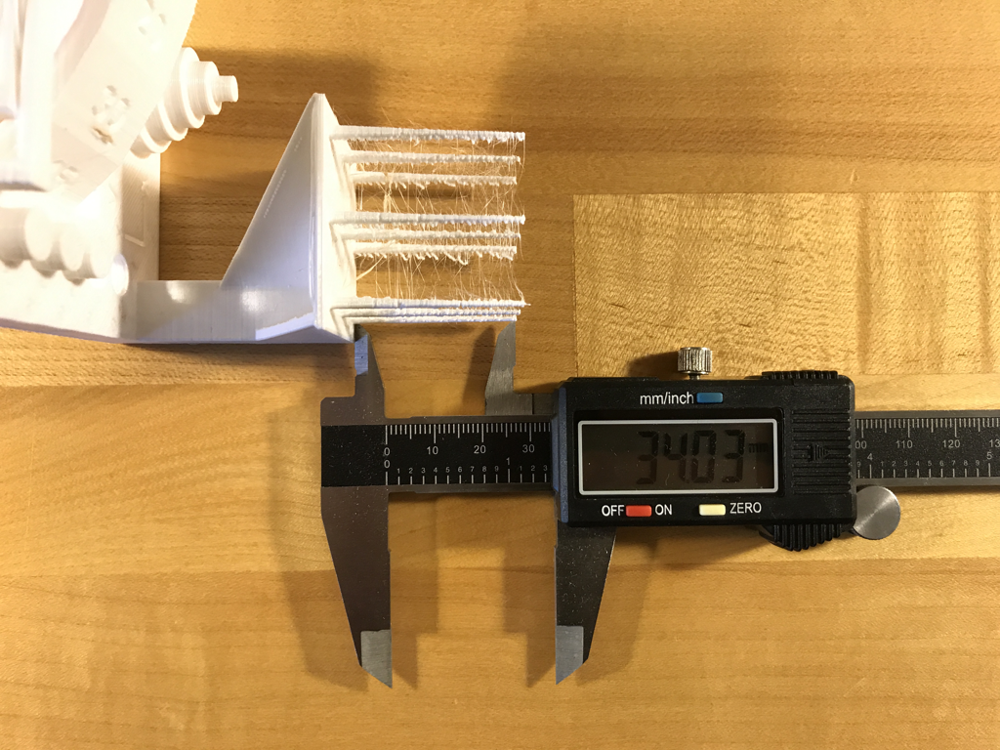
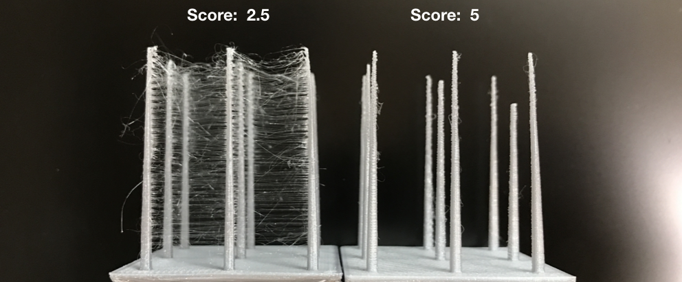
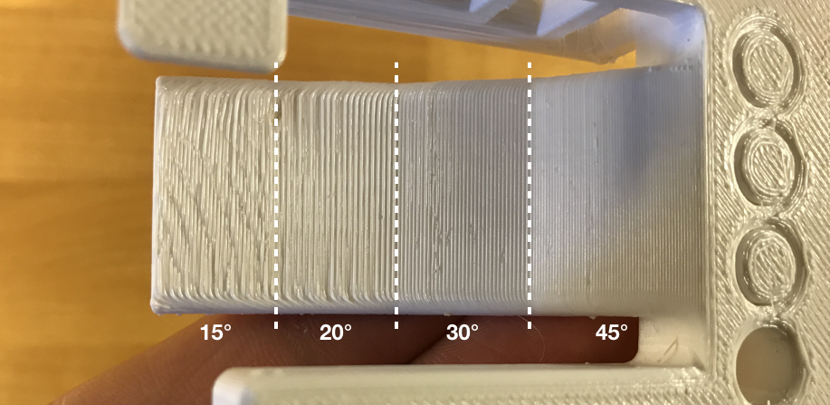
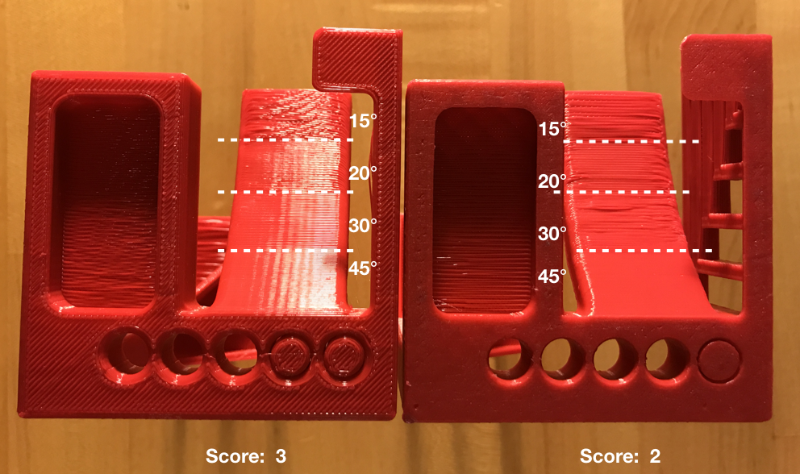
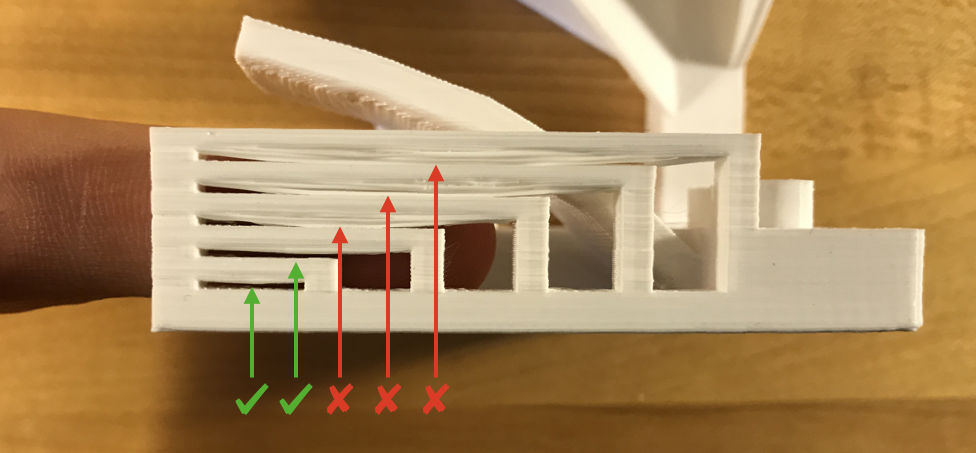
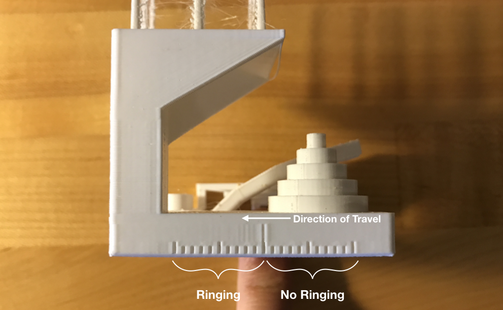

## FDM Assessment Protocol

Print the test geometry using ESUN PLA+ Cool White filament, available in both [1.75mm](https://www.amazon.com/gp/product/B01EKEMFQS) and [2.85mm](https://www.amazon.com/dp/B01EKFV60S/) sizes using “standard” settings (i.e. all default settings).  It is very important to use the same material, as rheological and thermal properties of materials can vary dramatically between manufacturers, effectively invalidating any results obtained without controlling material properties.

What this geometry does test:

* Dimensional accuracy (backlash optional)
* Negative feature resolution
* Positive feature resolution/fine flow control
* Basic overhang capabilities
* Basic bridging capabilities
* XY ringing
* Z-axis alignment

What this geometry does not test:

* Warp/adhesion
* Overhang capabilities over a range of features (concave, convex, etc)
* Slicer handling of fine XY plane features (positive and negative space)
* Complex bridging situations
* Surface finish over a range of features
* Extrusion temperature optimization
* Support structure/geometry interaction

This geometry can be used both to characterize and compare different 3D printers and to tune parameters relevant to different features present in the geometry.

### 1. Dimensional Accuracy

*To assess dimensional accuracy, measure each tier of the dimensional accuracy stack and record in a table like so:*

**Target**|**Measured X**|**Measured Y**|**X Error**|**Y Error**
:-----:|:-----:|:-----:|:-----:|:-----:
25|24.82|24.69|-0.18|-0.31
20|19.93|19.75|-0.07|-0.25
15|14.99|14.82|-0.01|-0.18
10|10.01|9.85|0.01|-0.15
5|4.84|4.84|-0.16|-0.16
Avg Err:|-0.082|-0.21| |
 **Average of avg. X and avg. Y error** | **-0.146** | | |
Difference between avg. X and avg. Y error|0.128| | |

* Record a “1” if the magnitude of the overall average error is greater than 0.40mm.
* Record a “2” if the magnitude of the overall average error is between 0.31 and 0.40mm.
* Record a “3” if the magnitude of the overall average error is between 0.21 and 0.30mm.
* Record a “4” if the magnitude of the overall average error is 0.11 and 0.20mm.
* Record a “5” if the magnitude of the overall average error is between 0.0 and 0.10mm.

While it is not explicitly scored in this evaluation, this test also reveals the presence of backlash (or incorrectly calibrated motion systems) when the average X and average Y errors are compared.  A significant difference between the two values indicates a problem.  

### 2. Fine Flow Control

*Using a pair of calipers, measure the height of the shortest spire on the top of the test print.  Visually inspect for threads of material connecting the spires.*

*Measure the shortest spire.  This print would score 2.5.*

* If the spires are less than 30mm long, assign a 0.
* If the spires are greater than 30mm, but there is stringing between them, assign a 2.5.
* If the spires are greater than 30mm long and there is no stringing between them, assign a 5.  

### 3. Fine Negative Features

*Attempt to remove all the pins from their holes using fingers (no tools).  The example above would score 2.*

* Record a “0” if no pins can be removed.
* Record a “1” if 1 pin can be removed.
* Record a “2” if 2 pins can be removed.
* Record a “3” if 3 pins can be removed.
* Record a “4” if 4 pins can be removed.
* Record a “5” if all pins can be removed.

### 4. Overhangs

*Inspect the overhang surfaces.  This print would score 3.*

* Record a “1” if the printer compiled the geometry but dropped loops and infill on the 15, 20, and 30 degree overhangs.
* Record a “3” if only the 15 and 20 degree surfaces differ from the 45 degree overhang.
* Record a “4” if only the 15 degree overhang differs from the 45 degree overhang.
* Record a “5” if there the surface finish between all four overhang surfaces is equivalent.

### 5. Bridging

Inspect for contact between bridges and the surface beneath each.  This example would score 2.  

* Record a “1” if more than 3 are in contact with the surfaces beneath them.
* Record a “2” if 3 bridges contact the surfaces beneath them.
* Record a “3” if 2 bridges contact the surfaces beneath them.
* Record a “4” if 1 bridge contacts the surface beneath it.
* Record a “5” if no bridges contact the surfaces beneath them.

### 6. XY Resonance

*Visually inspect the X and Y ringing features, illuminating the test print from the side to highlight any ringing captured in the print.  This example would score 0.*

If rippling in the X or Y axis can be observed at or past three hash marks, record a “0”, otherwise, record a “2.5”.

### 7. Z-axis alignment

If a layer registration effect with a period equal to that of the leadscrew is visible on the pillar supporting the fine positive features test, record “0,” otherwise, record “2.5.”

## Scoring
Sum the results of each section of the test protocol.  The highest possible score is 30, indicating a very well-calibrated system. For reference, a Prusa i3 MK3 scores 22.5 and a Makerbot Replicator 2 scores 18.
